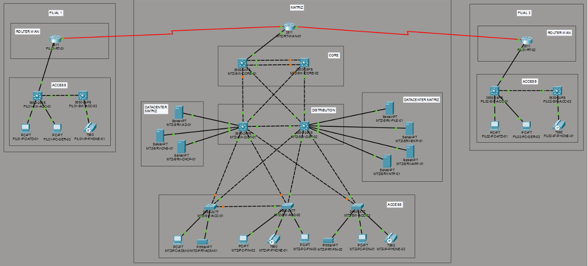
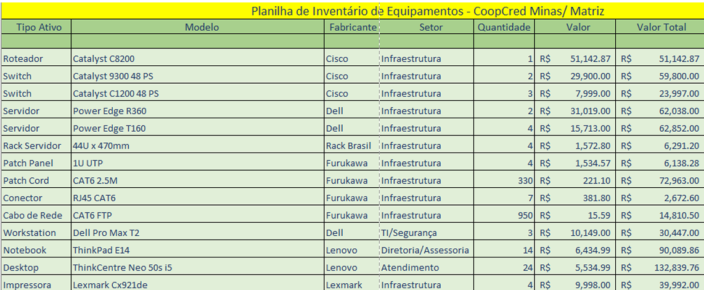
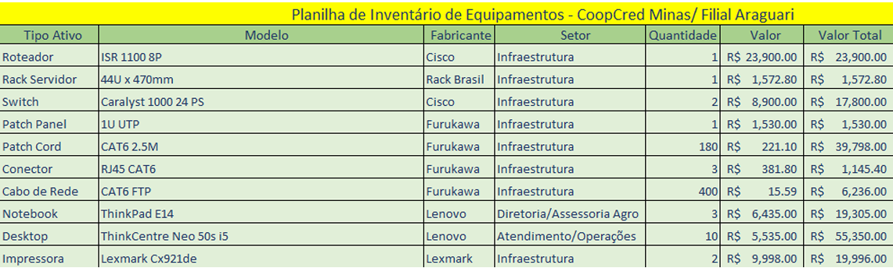
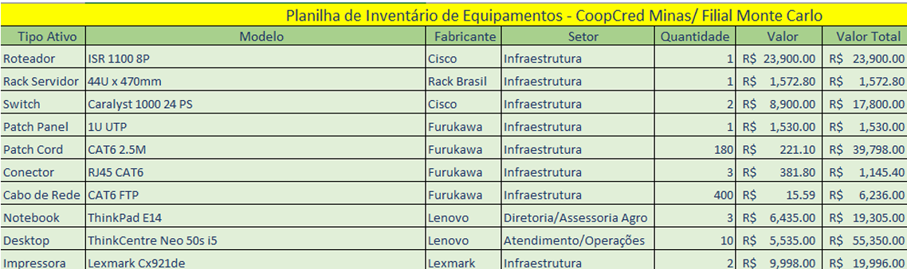

# Introdução 
## Contexto da Cooperativa
A CoopCred Minas é uma cooperativa financeira regional sediada em Uberlândia, Minas Gerais, com filiais em Araguari e Monte Carmelo. Sua atuação está voltada ao atendimento de produtores rurais, pequenos empreendedores rurais, micro e pequenos empresários, trabalhadores, comerciantes e famílias do Triângulo Mineiro, oferecendo soluções financeiras adaptadas à realidade econômica da região. A cooperativa tem como foco o fortalecimento do setor agropecuário, o apoio aos pequenos negócios locais e o desenvolvimento socioeconômico regional, por meio de crédito, relacionamento próximo com os associados e incentivo à educação financeira. 

Trata-se de uma organização com atuação regional e estrutura distribuída. A matriz concentra a governança, a gestão e os principais setores administrativos e estratégicos, mas também realiza atendimento ao cooperado por meio das Operações Bancárias e das atividades ligadas ao relacionamento com os associados. Já as filiais possuem estrutura mais enxuta, com foco maior no atendimento local, nas operações do dia a dia e no apoio às rotinas comerciais e de crédito.  

## História da Cooperativa

A CoopCred Minas foi fundada há cerca de 15 anos por agricultores, pequenos produtores rurais e empresários locais que buscavam acesso a crédito com condições mais justas, fortalecimento da economia regional, menor dependência de grandes bancos e incentivo a práticas sustentáveis no campo. A proposta inicial era criar uma instituição financeira cooperativa mais próxima da realidade do interior mineiro e mais alinhada às necessidades dos seus associados.

A ideia surgiu em encontros comunitários e associações de produtores ligados aos setores de grãos, leite e pecuária. Com apoio técnico de cooperativas estaduais e de sindicatos rurais, a cooperativa foi formalizada e iniciou suas atividades em um pequeno escritório na região central de Uberlândia. Com o passar do tempo, a expansão do número de associados e da demanda por serviços levou à abertura da filial de Araguari, em uma área agrícola estratégica, e posteriormente da unidade de Monte Carmelo, próxima a regiões com forte presença de café e pecuária. Atualmente, a cooperativa reúne milhares de associados entre produtores rurais, trabalhadores, comerciantes e famílias da região.

## Missão, visão e valores
Missão: fomentar o desenvolvimento socioeconômico de Minas Gerais por meio de soluções financeiras justas, acessíveis e cooperativas.

Visão: ser referência no apoio financeiro ao agronegócio sustentável e à economia local no interior de Minas Gerais.

Valores: cooperação, transparência, ética, sustentabilidade e educação financeira. Esses princípios orientam a gestão da cooperativa, a relação com os associados e o posicionamento institucional da organização.  

## Serviços e Produtos

A CoopCred Minas oferece produtos e serviços financeiros voltados às necessidades do seu público regional. Entre os principais produtos estão o crédito rural, o crédito para micro e pequenos negócios e o crédito familiar, atendendo diferentes perfis de cooperados e demandas econômicas da região.    

Além disso, a cooperativa realiza operações bancárias diárias, atendimento ao cooperado, ações de educação financeira e apoio técnico agrícola, reforçando seu papel como instituição financeira cooperativa voltada não apenas à oferta de crédito, mas também ao suporte contínuo aos associados e ao desenvolvimento regional.  

## Público-alvo
O público-alvo da CoopCred Minas é composto principalmente por produtores rurais, pequenos empreendedores rurais, micro e pequenos empresários, trabalhadores, comerciantes e famílias da região. Sua atuação busca atender tanto às demandas financeiras do agronegócio quanto às necessidades de crédito e apoio financeiro de pequenos negócios e da população local, considerando as características econômicas do Triângulo Mineiro.  

## Modelo cooperativo
A CoopCred Minas funciona com base no modelo cooperativo, no qual os associados não são apenas usuários dos serviços, mas também participantes da instituição. Nesse formato, os cooperados têm direito a voto nas decisões da cooperativa, participam das definições institucionais por meio das estruturas de governança e se beneficiam de um modelo voltado ao interesse coletivo, e não à lógica de investidores externos.  

Além disso, os resultados da cooperativa são revertidos para a própria organização e para os cooperados, e os serviços são pensados de forma mais próxima da realidade local e rural. Esse modelo diferencia a cooperativa das instituições financeiras tradicionais, especialmente pelo foco em proximidade, participação e atendimento ajustado ao perfil dos associados.  

## Estrutura macro (matriz e filiais)
A estrutura da cooperativa é formada por uma matriz em Uberlândia e duas filiais regionais, localizadas em Araguari e Monte Carmelo. A matriz concentra a maior parte da estrutura institucional, reunindo órgãos de governança como Assembleia Geral, Conselho de Administração, Conselho Fiscal e Diretoria Executiva, além dos setores de Administração e Finanças, TI e Segurança de Dados, Risco e Compliance, Crédito e Análise Financeira, Operações Bancárias, Assessoria Técnica Agro e Marketing e Comunicação. Ao todo, a matriz conta com 41 colaboradores.   

As filiais possuem estrutura reduzida e foco mais operacional e comercial, sendo compostas por Gerência, Atendimento, Operações Bancárias e Crédito e Análise Financeira. Cada unidade conta com 10 colaboradores e exerce papel essencial no relacionamento direto com os cooperados e na execução das atividades cotidianas da cooperativa nas cidades em que atua.  

# Estrutura Organizacional

## Departamentos e Setores
A estrutura organizacional da CoopCred Minas segue o modelo de governança cooperativa, onde os membros participam das tomadas de decisão. A matriz constitui as seguintes divisões de responsabilidade e departamentos:

- **Assembleia Geral**: órgão supremo da cooperativa, com gestão democrática, onde os sócios tomam decisões sobre os negócios.
- **Conselho de Administração**: gerência os negócios, define diretrizes e zela pelos interesses dos associados.
- **Conselho Fiscal**: fiscaliza a gestão financeira e patrimonial, relata à Assembleia Geral sobre os resultados econômico-financeiros.
- **Diretoria Executiva**: executa as diretrizes vindas do Conselho de Administração, gerência operações, implementa estratégias, define metas, coordena departamentos. 
- **Diretor Administrativo e Financeiro**: coordena e supervisiona as operações administrativas e financeiras, garantindo conformidade e eficiência nos processos. 
    - Setores: 
        - Administração e Finanças
        - TI e Segurança de Dados
        - Risco e Compliance
- **Diretor de Operações**: supervisiona e otimiza operações diárias das unidades da organização.
    - Setores: 	
        - Crédito e Análise Financeira
        - Crédito Rural
        - Crédito para Micro/Pequenos Negócios
        - Crédito Familiar
        - Operações Bancárias (Caixa e atendimentos diários)
- **Diretor de Relações com Associados**: realiza a gestão da imagem e reputação da organização; cuida do relacionamento e experiência da base de associados. 
    - Setores: 
        - Assessoria Técnica Agro (Ajudar produtores, Consultoria, Parcerias com agrônomos)
        - Marketing e Comunicação

As filiais da cooperativa seguem com uma estrutura reduzida e focada no atendimento e comercial, gerenciadas pelos seus gerentes locais e diretor do departamento de operações. Possuem os seguintes setores:
- Gerência
- Atendimento
- Operações bancárias
- Crédito e Análise Financeira

Abaixo se encontra a disposição de colaboradores por departamentos:
###
##### **Matriz - Uberlândia**
| Lideranças, Conselhos  e Departamentos | Setor | Colaboradores |
| --- | --- | --- |
| Assembléia Geral | - | 3 |
| Conselho de Administração | - | 2 |
| Conselho Fiscal | - | 2 |
| Diretoria Executiva | - | 3 |
| Administrativo e Financeiro | Administração e Finanças | 6 |
|  | TI e Segurança de Dados | 3 |
|  | Risco e Compliance | 2 |
| Operações | Crédito e Análise Financeira | 8 |
|  | Operações Bancárias | 6 |
| Relações com Associados | Assessoria Técnica Agro | 4 |
|  | Marketing e Comunicação | 2 |
| **Total** | - | **41** |

##
##### **Filial - Araguari e Monte Carmelo**

| Setor | Colaboradores **(Filial - Araguari)** | Colaboradores **(Filial - Monte Carmelo)** |
| --- | --- | --- |
| Gerência | 1 | 1 |
| Atendimento | 3 | 3 |
| Operações | 4 | 4 |
| Crédito e Análise Financeira | 2 | 2 |
| **Total** | **10** | **10** |

## Organograma
Abaixo se encontra os organogramas da estrutura organizacional da unidade matriz e das filiais da cooperativa:

# Especificação do Projeto

## Metodologia
Para o desenvolvimento do projeto de rede da Cooperativa CoopCred Minas, será adotada a metodologia Top-Down, com foco em atender as necessidades do cliente. 

A metodologia Top-Down é separada em fases distintas, começando com a análise de requisitos para entender os objetivos de negócios e técnicos da organização, que irá auxiliar nas especificações do projeto para o início do desenvolvimento da parte lógica e física da rede. 

Após o desenvolvimento o projeto entra na fase de teste, otimização e documentação, seguindo pela implementação em conjunto de testes com a rede em operação. O projeto concluí com o monitoramento e otimização de desempenho da rede. 

## Requisitos 
### Requisitos de negócio
A meta da CoopCreed Minas é crescer seu negócio, expandindo para novas localidades do estado de Minas Gerais, e fornecer novas soluções financeiras. Também foi identificado os seguintes objetivos da organização: 

- Oferecer novos serviços financeiros aos seus cooperados e melhor suporte;
- Expandir a participação no mercado;
- Aumentar o lucro do seu negócio;
- Não precisar interromper seus negócios por longos períodos de tempo devido a problemas de rede; 

As prioridades do negócio são as seguintes: 

- Serviços fornecidos;
- Segurança dos dados de seus clientes;
- Resiliência; 
- Continuidade do negócio;

O escopo do projeto abrange o desenvolvimento de uma nova rede corporativa, para uma matriz e duas filiais. 

### Restrições
Como restrições do projeto, foram esclarecidas as seguintes condições: 

Prazo de execução do projeto: 5 meses, de fevereiro à junho.  

### Coleta de Dados

#### Computadores e Dispositivos Estimados
O dimensionamento dos ativos de rede da CoopCred Minas foi realizado com base na estrutura de governança e divisões administrativas da cooperativa. A estimativa considera a necessidade de alta disponibilidade para as operações bancárias e mobilidade para a assessoria técnica em campo.

Distribuição por Setor Organizacional:

Abaixo, detalha-se a quantidade de estações de trabalho (Desktops e Notebooks) alocadas conforme as diretorias e conselhos definidos na tabela:
Além das estações de trabalho, a rede contempla dispositivos periféricos e de segurança essenciais para a operação financeira:

| **Departamento / Setor** | **Perfil de Hardware** | **Matriz** | **Filial 01** | **Filial 02** | **Justificativa Técnica** |
| --- | --- | --- | --- | --- | --- |
| Lideranças e Conselhos | Notebook | 10 | 01 | 01 | Mobilidade para reuniões de governança e decisões estratégicas. |
| Adm. e Finanças | Desktop | 06 | - | - | Processamento de rotinas administrativas fixas na matriz. |
| TI e Segurança de Dados | Workstation | 03 | - | - | Gestão da infraestrutura e monitoramento de segurança. |
| Risco, Compliance e Marketing | Desktop | 04 | - | - | Gestão de normas e comunicação institucional. |
| Crédito e Análise Financeira | Desktop | 08 | 02 | 02 | Suporte a sistemas de análise de risco, crédito rural e BI. |
| Assessoria Técnica Agro | Notebook | 04 | 02 | 02 | Uso essencial em campo e visitas a produtores rurais. |
| Operações e Atendimento | Desktop | 06 | 08 | 08 | Terminais para caixas, gerência local e atendimento ao público. |
| **TOTAL ESTAÇÕES** |  | **41** | **13** | **13** | **Total Geral: 67 unidades** |

#

| **Dispositivo** | **Função na Rede** | **Matriz** | **Filial 01** | **Filial 02** | **Camada de Conexão** |
| --- | --- | --- | --- | --- | --- |
| Telefones IP (VoIP) | Comunicação Integrada | 41 | 12 | 12 | Acesso (PoE) |
| ATMs (Caixas Eletrônicos) | Automação Bancária | 04 | 02 | 02 | Acesso (Segura) |
| Câmeras IP (CFTV) | Monitoramento | 12 | 08 | 08 | Acesso (Isolada) |
| Impressoras de Rede | Documentação | 04 | 02 | 02 | Acesso |
| Access Points (WAP) | Wi-Fi Corporativo | 06 | 03 | 03 | Acesso (PoE) |
| Servidores | Processamento/Dados | 06 | 00* | 00* | Core/Data Center |

Para garantir a escalabilidade do negócio e permitir o crescimento futuro da cooperativa sem a necessidade imediata de novos investimentos em ativos centrais:
- **Matriz (Uberlândia):** 
    - Necessidade atual de portas ativas: 114 (Estações + Periféricos + Servidores).
    - Com margem de 20%: 137 portas.
    - Recomendação: Uso de 03 Switches de Acesso de 48 portas cada (Totalizando 144 portas).
- **Filiais (Araguari / M. Carmelo):**
    - Necessidade atual de portas ativas por unidade: 40.
    - Com margem de 20%: 48 portas.
    - Recomendação: Uso de 02 Switches de Acesso de 24 portas cada para garantir redundância local e expansão

# Topologia

## Planejamento Lógico da Rede

Considerando o alto nível de criticidade das operações financeiras, que exigem disponibilidade contínua, integridade dos dados e segurança da informação, adotou-se uma arquitetura hierárquica baseada no modelo de três camadas da Cisco (Core, Distribution e Access) para a Matriz, garantindo alta performance, segmentação adequada e facilidade de gerenciamento.

Nas filiais regionais, por apresentarem menor volume de tráfego e complexidade estrutural, foi adotado modelo simplificado em duas camadas (Distribution e Access), mantendo a padronização arquitetural sem gerar custos desnecessários.

Por se tratar de uma cooperativa bancária de atuação regional no estado de Minas Gerais, com unidades concentradas em cidades próximas (como Uberlândia e municípios vizinhos), optou-se por modelo de comunicação WAN hierárquico do tipo Hub-and-Spoke, no qual a Matriz atua como núcleo central de processamento e interligação das filiais. Essa abordagem permite controle centralizado, maior segurança e redução de complexidade operacional.

Para garantir alta disponibilidade e continuidade dos serviços financeiros, adotou-se conectividade do tipo Dual-Homed tanto na matriz quanto nas filiais, utilizando dois provedores distintos de acesso à internet, possibilitando failover automático em caso de indisponibilidade de um dos links.

A opção por Dual-Homed, em vez de Multi-Homed com roteamento BGP, justifica-se pelo porte regional da cooperativa, pelo volume moderado de tráfego e pela relação custo-benefício, uma vez que soluções Multi-Homed são mais indicadas para instituições de grande porte com data centers próprios e operação em múltiplos estados ou países.

## Definição dos Servidores e Endereçamento Estático

Devido à criticidade das operações financeiras e à necessidade de disponibilidade contínua dos serviços corporativos, os principais servidores da infraestrutura foram centralizados na matriz, onde se encontra o núcleo de processamento da rede.

A centralização dos serviços permite maior controle administrativo, facilidade de backup, melhor aplicação de políticas de segurança e redução de custos operacionais.

Para garantir estabilidade e evitar conflitos de endereçamento, todos os servidores utilizam endereçamento IP estático.

A distribuição definida foi a seguinte:

| Servidor | Função | Localização | Endereço IP |
| --- | --- | --- | --- |
| MTZ-SRV-AD-01 | Controlador de Domínio / Active Directory | Matriz | 192.168.0.10 |
| MTZ-SRV-DNS-01 | Servidor DNS interno | Matriz | 192.168.0.11 |
| MTZ-SRV-DHCP-01 | Distribuição automática de IP | Matriz | 192.168.0.12 |
| MTZ-SRV-FILE-01 | Servidor de arquivos corporativos | Matriz | 192.168.0.13 |
| MTZ-SRV-BKP-01 | Servidor de backup | Matriz | 192.168.0.14 |
| MTZ-SRV-APP-01 | Aplicações financeiras da cooperativa | Matriz | 192.168.0.15 |

Nas filiais, por se tratar de estruturas menores e com menor volume de processamento, não há servidores dedicados, sendo que os serviços são consumidos diretamente da matriz através da rede WAN.

Essa abordagem reduz custos de infraestrutura, simplifica a administração e mantém os dados centralizados para maior segurança e controle.

## Serviços de Rede Disponibilizados

Para garantir o funcionamento adequado da infraestrutura tecnológica da cooperativa, foram implementados diversos serviços de rede essenciais, responsáveis pela autenticação de usuários, gerenciamento de endereçamento IP, resolução de nomes e armazenamento de dados.

Os principais serviços disponibilizados são:
- **Active Directory (AD):** Responsável pelo gerenciamento centralizado de usuários, computadores e permissões de acesso dentro da rede corporativa. Permite controle de autenticação, políticas de segurança (Group Policies) e organização dos recursos da rede.
- **DNS (Domain Name System):** Realiza a resolução de nomes de domínio internos, permitindo que dispositivos acessem servidores utilizando nomes em vez de endereços IP. Exemplo: srv-arquivos.cooperativa.local
- **DHCP (Dynamic Host Configuration Protocol):** Responsável pela distribuição automática de endereços IP para dispositivos da rede, reduzindo a necessidade de configuração manual e minimizando erros administrativos.
- **Servidor de Arquivos:** Centralizar o armazenamento de documentos corporativos, relatórios financeiros e arquivos administrativos, permitindo acesso controlado por permissões definidas no Active Directory.
- **Servidor de Aplicações:** Hospeda o sistema financeiro utilizado pela cooperativa, responsável pelo gerenciamento de contas, transações e operações bancárias.
- **Servidor de Backup:** Responsável pela realização de cópias de segurança periódicas dos dados críticos da organização, garantindo recuperação em caso de falhas, ataques ou perda de dados.
- **VPN Site-to-Site:** Garante comunicação segura entre a matriz e as filiais através da rede WAN.
- **NTP Interno (Network Time Protocol):** Responsável pela sincronização de horário entre os dispositivos da rede, garantindo consistência em registros de auditoria e logs.

A centralização dos serviços na matriz garante maior controle administrativo, simplifica a manutenção da infraestrutura e contribui para a segurança e disponibilidade dos dados corporativos.

## Padrão de Nomenclatura dos Dispositivos

Foi adotado um padrão estruturado para identificação de todos os ativos de rede, composto por: [LOCAL]-[TIPO]-[IDENTIFICADOR]
Exemplos:
- MTZ-SRV-01 (Servidor da Matriz)
- MTZ-SW-CORE-01 (Switch Core da Matriz)
- FIL01-SW-01 (Switch da Filial 1)
- FIL02-PC-ATD-05 (Computador de Atendimento da Filial 2)

A adoção de um padrão de nomenclatura estruturado permite:

- Identificação rápida de localização e função do equipamento
- Facilidade na documentação e inventário
- Agilidade na abertura e resolução de chamados técnicos
- Redução de erros operacionais

## Planejamento de Endereçamento IP
Foi adotado o bloco privado Classe C: 192.168.0.0/16, conforme definido pelo padrão RFC 1918 para redes internas.

Essa escolha foi realizada considerando o porte da cooperativa, composta por uma matriz e duas filiais, o que não demanda grandes blocos de endereçamento como os oferecidos pela Classe A.

A utilização de endereços privados Classe C oferece diversas vantagens:
- Simplicidade de gerenciamento da rede;
- Facilidade de implementação e documentação;
- Compatibilidade com a maioria das infra estruturas corporativas de pequeno e médio porte;
- Redução de complexidade no planejamento de sub-redes.

Além disso, a utilização de faixas privadas garante conformidade com boas práticas de segurança, evitando exposição direta da estrutura interna da rede à internet pública.

Para manter a organização e facilitar a expansão futura da cooperativa, cada unidade recebeu um bloco de rede próprio, permitindo isolamento lógico entre as unidades e simplificando a implementação de políticas de roteamento entre matriz e filiais.

A distribuição das redes foi definida da seguinte forma:

| Unidade | Rede Base |
| --- | --- |
| Matriz | 192.168.0.0/24 |
| Filial 1 | 192.168.1.0/24 |
| Filial 2 | 192.168.2.0/24 |

## Máscaras e Sub-redes
Foram adotadas sub-redes com máscara /24 para cada departamento, permitindo até 254 dispositivos por VLAN.

Essa escolha proporciona:
- Capacidade suficiente para crescimento
- Simplicidade de configuração
- Padronização administrativa
- Facilidade de troubleshooting

## Diagrama da Topologia

## Planilha de Equipamentos
Tabela 1. Tabela de equipamentos da matriz

Tabela 2. Tabela de equipamentos da filial Araguari

Tabela 3. Tabela de equipamentos da filial Monte Carlo

