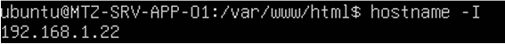
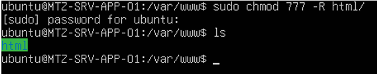
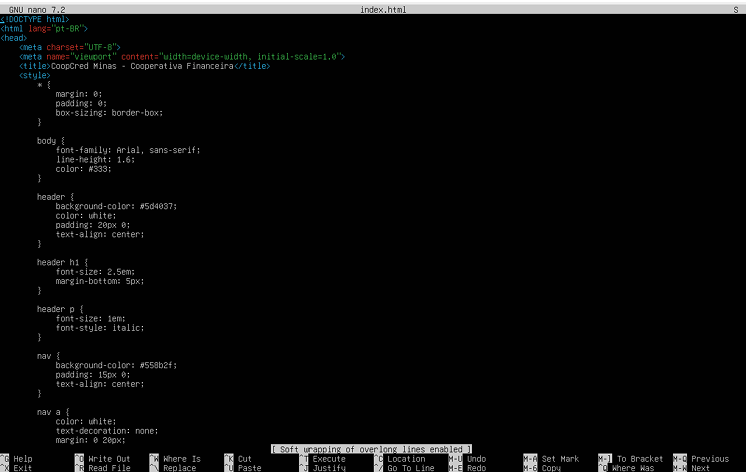
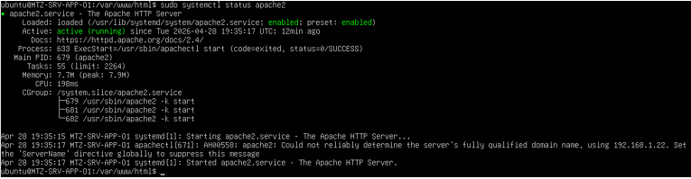
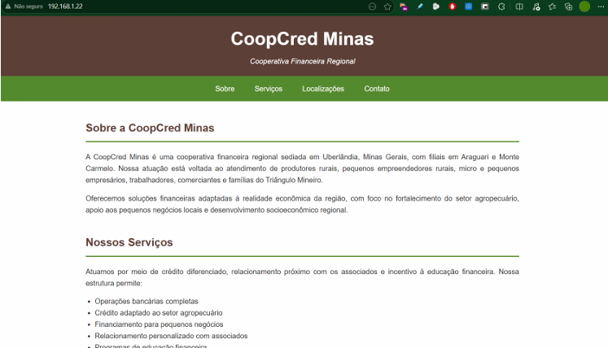

# Configuração de Serviços de Rede 
 
## Serviços On-Premise  

### Servidor de aplicações 
Para a hospedagem das aplicações web da cooperativa foi utilizado o Apache HTTP Server, com sua instalação e configuração em uma VM Ubuntu Server 22.04 LTS em ambiente local. Nas imagens abaixo é possível visualizar registros da configuração e hospedagem de uma aplicação da cooperativa.  

<small>IP de acesso ao servidor da aplicação web.</small>

<small>Comando para permitir leitura e edição dentro do diretório do Apache.</small>

<small>Modificação do arquivo index.html no diretório /var/www/html. </small>

<small>Verificação do status do serviço Apache no servidor.  </small>

<small>Acesso da aplicação hospedada. </small>

<small> Perfil de regra do firewall para o serviço Apache. Portas permitidas: 80, 443/tcp. </small> 

Demonstração do serviço em vídeo: [Servidor Web](https://sgapucminasbr-my.sharepoint.com/personal/1497787_sga_pucminas_br/_layouts/15/guestaccess.aspx?share=IQAICZjdXEqlSJV2Un0pTDYoAbeUai_zZDafv5q5Fct8HX0&nav=eyJyZWZlcnJhbEluZm8iOnsicmVmZXJyYWxBcHAiOiJPbmVEcml2ZUZvckJ1c2luZXNzIiwicmVmZXJyYWxBcHBQbGF0Zm9ybSI6IldlYiIsInJlZmVycmFsTW9kZSI6InZpZXciLCJyZWZlcnJhbFZpZXciOiJNeUZpbGVzTGlua0NvcHkifX0&e=o6cjJI). 
 
### Serviços em Cloud (AWS) 
### Configuração da VPC 

Foi criada uma VPC denominada eixo-5-vpc na região US East (N. Virginia), com CIDR IPv4 10.0.0.0/16 e DNS habilitado. O Security Group configurado permite tráfego de entrada nas portas 80 (HTTP) e 3389 (RDP), possibilitando tanto o acesso web quanto a conexão remota à instância. 

 

 

### Criação da Instância EC2 
Uma instância EC2 do tipo t2.large foi provisionada com a imagem do Windows Server 2022, associada à VPC criada anteriormente. Após a inicialização, a conexão remota foi estabelecida com sucesso via RDP utilizando o IP público 3.237.60.155, confirmando que o servidor estava operacional. 

### Instalação do AD DS e DNS 
Com acesso ao servidor via Windows PowerShell, foi executado o comando Install-WindowsFeature para instalar as funções de Active Directory Domain Services e DNS Server. A instalação foi concluída com sucesso, retornando o status Success, sem necessidade de reinicialização imediata. 

### Promoção a Domain Controller 
Após a instalação das funções, o servidor foi promovido a Domain Controller por meio do cmdlet Install-ADDSForest, criando uma nova floresta com o domínio coopcred.local. Ao final do processo, o sistema exibiu a notificação de reinicialização para aplicar as configurações do Active Directory. 

 

 
### Reconexão e criação das Unidades Organizacionais  
Após o reinício, a conexão remota foi reestabelecida utilizando as credenciais do domínio (COOPCRED\Administrator). Em seguida, foram criadas as Unidades Organizacionais (OUs) representando a estrutura da empresa: a Matriz em Uerlândia com seus departamentos, e duas filiais — Filial01 em Araguari e Filial02 
em Monte Carmelo — cada uma com seus respectivos departamentos. 

 
### Criação dos usuários 
Utilizando uma função PowerShell personalizada (New-CooUser), foram criados usuários fictícios por departamento, com login padrão no formato login@coopcred.local e senhas definidas via ConvertTo-SecureString. Entre os usuários criados estão perfis como Diretor Executivo, Presidente do Conselho e administradores de TI. 

 
### Criação dos registros DNS  
Foram adicionados registros DNS do tipo A na zona coopcred.local para os servidores da infraestrutura, mapeando nomes como MTZ-SRV-AD-01, MTZ-SRV-DNS-01, MTZ-SRV-DHCP-01, MTZ-SRV-FILE-01, MTZ-SRV-BKP-01 e MTZ-SRV-APP-01 aos seus respectivos endereços IP na faixa 192.168.0.x. 

### Validação final   
Por fim, foram executados comandos de verificação para confirmar a integridade do ambiente: Get-ADDomain para validar as configurações do domínio, Get-ADOrganizationalUnit para listar todas as OUs criadas, Get-ADUser para confirmar todos os usuários ativos, e Get-DnsServerResourceRecord para verificar os registros DNS registrados na zona interna.

<small>Verificando domínio</small>

<small>Listando todas as unidades organizacionais criadas </small> 

<small>Listando todos usuários</small>

<small>Verificando registros DNS</small> 

Acesse a demonstração do serviço em vídeo [clicando aqui](https://youtu.be/qV2jEI7a-Zk). 